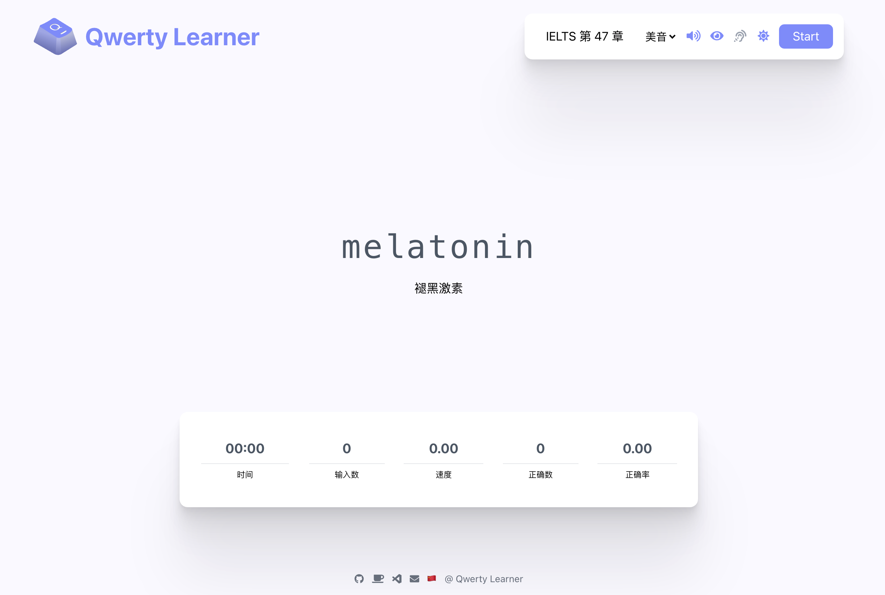

<h1 align="center">
  Qwerty Learner
</h1>

  <a href="./docs/README_EN.md">English</a>

  为键盘工作者设计的单词记忆与英语肌肉记忆锻炼软件

  
  
  

## 📸 在线访问

Vercel: <https://qwerty.kaiyi.cool/> , <https://qwerty-learner.vercel.app/>
GitHub Pages: <https://realkai42.github.io/qwerty-learner/>
Gitee Pages: <https://kaiyiwing.gitee.io/qwerty-learner/>

国内用户建议使用 Gitee 访问
 
 

项目已发布 VSCode 插件版，一键启动、随时开始练习
[VSCode Plugin Market](https://marketplace.visualstudio.com/items?itemName=Kaiyi.qwerty-learner)
[GitHub](https://github.com/Realkai42/qwerty-learner-vscode)

 

## 快速部署

### Vercel

#### 部署步骤

1. 更新 `Vercel Build & Development Settings` -> `Output Directory`："build"
2. Click Deploy Button

 

## ✨ 设计思想

软件设计的目标群体为以英语作为主要工作语言的键盘工作者。部分人会出现输入母语时的打字速度快于英语的情况，因为多年的母语输入练就了非常坚固的肌肉记忆 💪，而英语输入的肌肉记忆相对较弱，易出现输入英语时“提笔忘字”的现象。

同时为了巩固英语技能，也需要持续的背诵单词 📕，本软件将英语单词的记忆与英语键盘输入的肌肉记忆的锻炼相结合，可以在背诵单词的同时巩固肌肉记忆。

为了避免造成错误的肌肉记忆，设计上如果用户单词输入错误则需要重新输入单词，尽可能确保用户维持正确的肌肉记忆。

软件也对需要机考英语的人群有一定的帮助。

**For Coder**：

内置了程序员工作常用单词的词库，方便练习工作中常用的单词、提高输入速度。也内置了诸多语言的 API 的练习，帮助以程序员快速熟悉常用的 API，更多语言的 API 正在逐步添加中...

 
 

## 🛠 功能列表

### 词库

内置了常用的 CET-4 、CET-6 、GMAT 、GRE 、IELTS 、SAT 、TOEFL 、考研英语、专业四级英语、专业八级英语，也有程序员常见英语单词以及多种编程语言 API 等词库。 尽可能满足大部分用户对单词记忆的需求，也非常欢迎社区贡献更多的词库。
 
 

### 音标显示、发音功能

方便用户在记忆单词时，同时记忆读音与音标。

 
 

### 默写模式

在用户完成一个章节的练习后，会弹出选项是否默写本章，方便用户巩固本章学习的单词。

 
 

### 速度、正确率显示

量化用户输入的速度和输入的正确率，让用户有感知的了解自己技能的提升

 
 

## 如何贡献

### 贡献代码

[Call for Contributor](https://github.com/Realkai42/qwerty-learner/issues/390)
[贡献准则](./docs/CONTRIBUTING.md)

### 贡献词库

[导入词典](./docs/toBuildDict.md)

## 运行项目

本项目是基于`React`开发的，需要 node 环境来运行。

### 手动安装

1. 安装 NodeJS，参考[官方文档](https://nodejs.org/en/download)
2. 使用 `git clone` 下载项目到本地, 不使用 git 可能因为缺少依赖而无法运行
3. 打开命令行，在项目根目录下，运行`yarn install`来下载依赖。
4. 执行`yarn start`来启动项目，项目默认地址为`http://localhost:5173/`
5. 在浏览器中打开`http://localhost:5173/`来访问项目。

### 脚本执行

对于 Windows 用户，可以直接执行 [install.ps1](scripts/install.ps1) 脚本，来一键安装依赖并启动项目。

1. 打开 powershell，定位到项目根目录中的`scripts`目录
2. 在命令行中，执行`.\install.ps1`
3. 等待脚本完成。

> 备注
> 脚本依赖`winget`来安装 node，仅在 Windows 10 1709（版本 16299）或更高版本上受支持！

对于 MacOS 用户，可以直接执行 [install.sh](scripts/install.sh) 脚本来一键安装依赖并启动项目

1. 打开终端，并进入此项目文件夹
2. 在命令行中执行 `scripts/install.sh`
3. 等待脚本完成

> 此脚本依赖于 `homebrew`，请确保自己电脑上可以执行`brew`命令

## 🏆 荣誉

- Github 全球趋势榜上榜项目
- V2EX 全站热搜项目
- Gitee 全站推荐项目
- [少数派首页推荐](https://sspai.com/post/67535)
- Gitee 最有价值开源项目([GVP](https://gitee.com/gvp))

## 📕 词库列表

- CET-4
- CET-6
- GMAT
- GRE
- IELTS
- SAT
- TOEFL
- 考研英语
- 专业四级英语
- 专业八级英语
- Coder Dict 程序员常用词
- 高考
- 中考
- 商务英语
- BEC
- 人教版英语 3-9 年级
- 王陆雅思王听力语料库 [@Saigyouji_WKKun](https://github.com/ggehuliang)
- 日语常见词、N1 ～ N5 [@xiaojia](https://github.com/wetery)

如果您需要背诵其他词库，欢迎在 Issue 中提出

 
 

## 📗 API 词库

- JavaScript API. [@sdu-gyf](https://github.com/sdu-gyf)
- Node.js API. [@chrysalis1215](https://github.com/chrysalis1215)
- Java API. [@darkSheep](https://github.com/SFAfreshman)
- Linux Command. [@归谜](https://github.com/vhxubo)
- C#: List API [@nidbCN](https://github.com/nidbCN)

目前 API 相关词库主要依赖于社区贡献，如果您想贡献自己需要的 API 词库，建议参考 [Issue #42](https://github.com/Realkai42/qwerty-learner/issues/40) [pr #67](https://github.com/Realkai42/qwerty-learner/pull/67) 贡献词典。

 
 

## 🎙 功能与建议

目前项目处于开发初期，新功能正在持续添加中，如果你对软件有任何功能与建议，欢迎在 Issues 中提出

项目的进展与未来计划在 [Issue](https://github.com/Realkai42/qwerty-learner/issues/42) 中详细介绍，内部也包含对未来功能的意见征询等，如果对 Qwerty Learner 的未来感兴趣，欢迎参与讨论。

如果你也喜欢本软件的设计思想，欢迎提交 pr，非常感谢你对我们的支持！
 
 

## 🏄‍♂️ 贡献指南

如果您对本项目感兴趣，我们非常欢迎参与到项目的贡献中，我们会尽可能地提供帮助

在贡献前，希望您阅读 [Issue #42](https://github.com/Realkai42/qwerty-learner/issues/42) 了解我们目前的开发计划，我们希望您能参与到"计划中"的工作亦或者 Issue 区 Label 为 "Help Wanted" 的工作，我们也非常欢迎您实现自己的想法。

如果您确定了想要参与的工作，希望在有基本进展后提交 draft pr，我们可以在 draft pr 上进行讨论，也有利于听取其他 collaborator 的意见。

再次感谢您对项目的贡献！🎉

 

## ☕️ Buy us a coffe

非常感谢大家使用 Qwerty Learner, 目前该网站由三个人用业余时间在维护，我们希望在未来购买独立的域名(目前使用 vercel 部署)，并购买服务器以方便国内用户访问与云同步存储数据。

如果您喜欢我们软件，非常感谢您对我们未来的支持!

## 👨‍💻 Contributors

## 🎁 大感谢

### 灵感来源

[Keybr](https://www.keybr.com/)
以算法著称，功能非常完善的打字网站，根据用户输入每个字母的正确率与速度生成“伪英语”来帮助用户集中锻炼个别输入较慢的字母。并可以根据用户的输入记录生成完整的分析报告。

也是本项目的核心灵感来源，Keybr 更多针对英语为母语的用户。在我使用 Keybr 练习打字时，觉得虽然生成的伪英语能够练习输入不顺畅的个别字母，但并不能提升非母语用户对单词的掌握，于是有了本项目。

[Typing Academy](https://www.typing.academy)
非常优秀的打字练习网站
其优秀的 UI 风格，以及对速度、正确率的展示极大的影响了本项目的 UI 设计

[react-code-game](https://github.com/webzhd/react-code-game)
一个非常酷的开源项目，使用 ts 实现，可以在练习打字的同时练习 js 内置 api，项目中添加代码 api 的想法便来源自此项目。
  

### 开源项目

[React](https://github.com/facebook/react) & [CRA](https://github.com/facebook/create-react-app)
完整和详细的文档对初学者非常友好，React 系的文档是我目前自学过程中读过最棒的文档，几乎解决使用中大部分问题。非常感谢 React 对开源世界的贡献，为我们搭建了很好的基础，让初学者也能构建非常棒的软件。

[Tailwindcss](https://tailwindcss.com/docs)
如果没有 tailwind，这个项目还有再拖一阵子，tailwind 的设计思路解决了 css 入门选手对写复杂 css 的恐惧，让新手以一个非常舒适的方式去设计 UI。
  

### 数据来源

字典数据来自于[kajweb](https://github.com/kajweb/dict)，项目爬取了常见的字典，也是这个项目让我看到了实现本项目的希望。

语音数据来源于[有道词典](https://www.youdao.com/)开放 API，感谢有道的贡献让我们这种小项目也可以用上非常专业的发音资源，感谢有道团队以及考神团队为中国教育与中外交流做出的重要贡献。

JS API 来自于[react-code-game](https://github.com/webzhd/react-code-game) ，感谢项目对 JS API 的爬取与预处理。
  

### 项目 Icon

感谢[libregd](https://github.com/libregd)提供图标设计，给项目贡献了多个好看的图标设计方案，同时也在项目的进行中提供了设计、建议、未来规划等诸多支持

### 感谢支持

感谢[云谦](https://github.com/sorrycc)、[大圣](https://github.com/shengxinjing) 在项目只有十几个 star 时关注了项目，给项目推进下去的动力。

 

也感谢在项目初期跟我讨论 idea、提供建议并时不时 Push 一下我的朋友们，没有你们这个 idea 可能还得再拖一年（🐶

感谢 [Pear Mini](https://github.com/pearmini) ，最开始跟我讨论 idea 给我项目支持，也是他的项目让我相信即使是一个学生的 idea 实现出来也可以很酷。 他的 [Gossip](https://github.com/pearmini/gossip) 项目完全是 Next Generation Slides 级别的创意！

感谢 [AZ](https://github.com/sailist)，鼓励我把 idea 实现出来（虽然我还是拖了很久），他无与伦比的行动力影响了我。他是一个非常酷的 lib maker，写了很多非常棒的 python 库，例如中文语音识别的框架[ASRFrame](https://github.com/sailist/ASRFrame)

感谢 [Luyu Cheng](https://github.com/chengluyu)，我认识的最酷的前端大佬，给项目与我的前端自学提供了无尽的帮助。在项目初期帮助我进行技术选型，在开发阶段帮我解决技术问题，为我不知道如何实现的 feature 提供技术思路，也为项目贡献了很多非常受欢迎的 feature。

## 🌟 Stargazers over time

